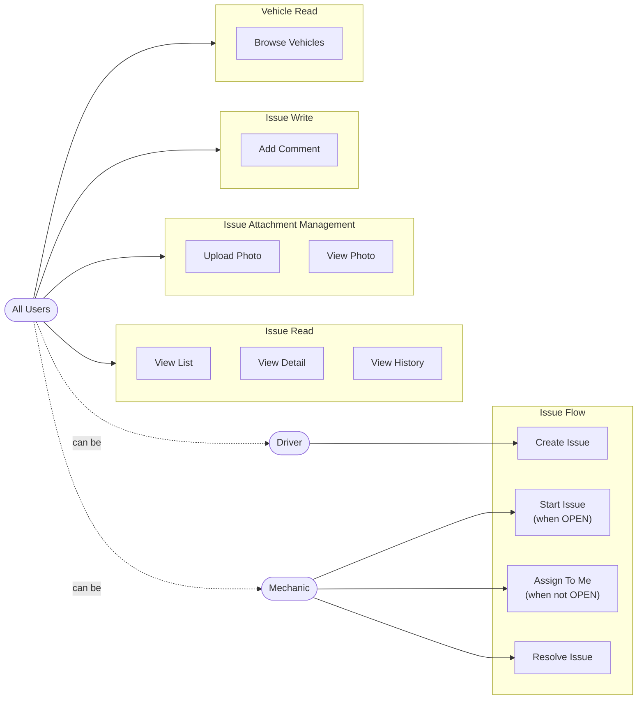
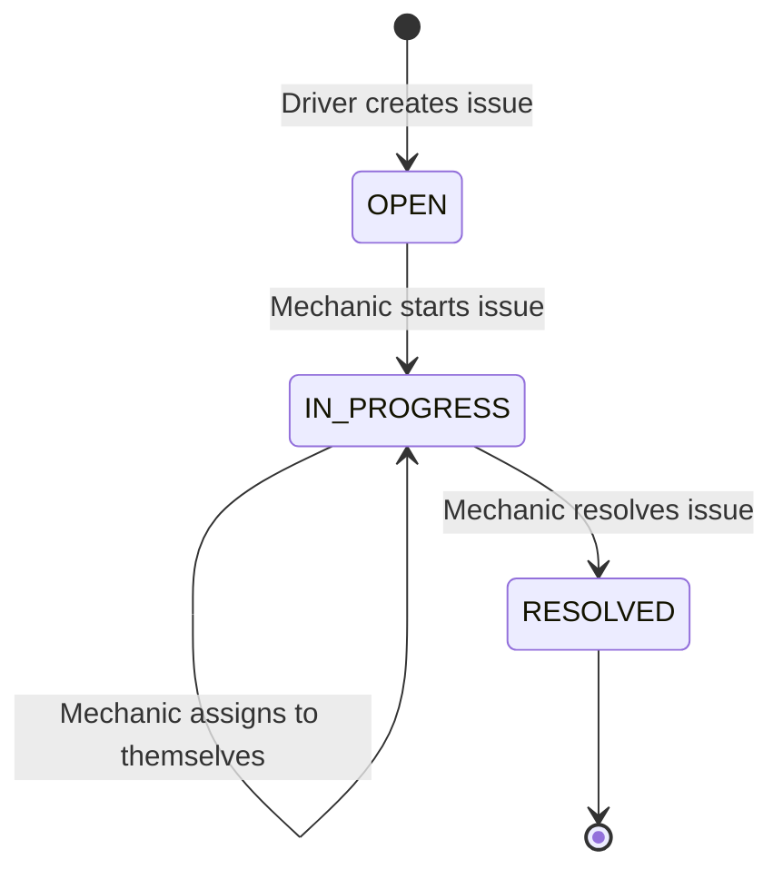
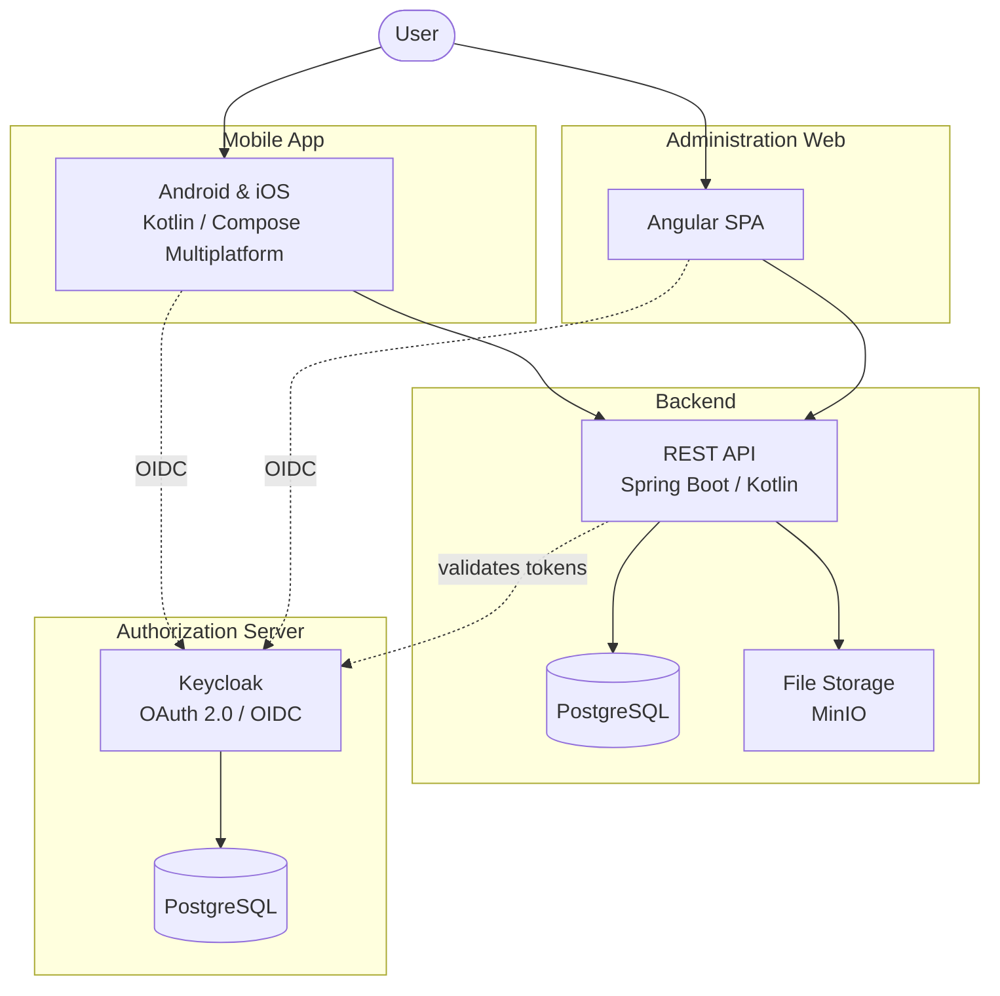

# TruckTrack

[](https://github.com/piskula/TruckerTracker-client/actions/workflows/build-app.yml)
[](https://github.com/piskula/TruckerTracker-client/actions/workflows/release-app.yml)
[](https://github.com/piskula/TruckerTracker-client/actions/workflows/build-server.yml)

Fleet-management monorepo for drivers and mechanics to report and track vehicle issues, manage
vehicles, and sign in via OAuth/OIDC — a Kotlin Multiplatform client (Android + iOS) and a Spring
Boot backend, sharing one contract module of DTOs.

## Contents

- [Architecture](#architecture)
- [Repository layout](#repository-layout)
- [Getting started](#getting-started)
- [Continuous integration](#continuous-integration)
- [AI and agent context](#ai-and-agent-context)
- [Contributing](#contributing)
- [Docs](#docs)

## Architecture

### Use Case Diagram



### Issue Lifecycle



### Component Diagram



## Repository layout

Three independent Gradle builds, orchestrated from the repo root as a **composite build**:

```
/
  settings.gradle.kts   ← thin orchestrator: includeBuild("app"), includeBuild("server"), includeBuild("shared")
  gradle/libs.versions.toml   ← single version catalog, shared by all three builds
  app/       ← Kotlin Multiplatform client (Android + iOS) — own settings.gradle.kts
  server/    ← Spring Boot backend — own settings.gradle.kts
  shared/    ← KMP contract module: DTOs used by both app/ and server/ — own settings.gradle.kts
```

Each is a fully self-contained Gradle build (own `gradlew`, own `settings.gradle.kts`) — not a
subproject of one giant build. This is deliberate: mixing the client's `kotlin.multiplatform`
plugin and the server's plain `kotlin.jvm` plugin in one shared build classpath triggers a
reproducible Kotlin 2.4.0 / Gradle 9.6.0 crash. Keeping the three builds structurally separate,
connected only by Gradle's composite-build dependency substitution, avoids it entirely.

| Part | What it is | Details |
|---|---|---|
| `app/` | Kotlin Multiplatform client — Compose Multiplatform UI, targets Android + iOS | `app/README.md` |
| `server/` | Spring Boot 4 backend — REST API, JPA/PostgreSQL, Keycloak auth | `server/README.md` |
| `shared/` | Contract module — `@Serializable` DTOs/enums consumed by both sides | `shared/README.md` |

## Getting started

Building everything at once, from the repo root:

```bash
./gradlew :app:app:android:assembleDebug :server:module-server:bootJar
```

For day-to-day work you'll usually want just one side:

- **Client work** — `cd app && ./gradlew ...`, a fully independent build that doesn't need
  `server/` or the repo root at all. See `app/README.md` for prerequisites, build/run
  instructions, and releasing.
- **Server work** — `cd server && ./gradlew ...`. See `server/README.md` for prerequisites
  (Docker for local Postgres/MinIO) and run instructions.
- **Opening in an IDE** — open the repo root for the full linked composite workspace, or open
  `app/` (or `server/`) alone for a faster, decoupled single-purpose workspace.

## Continuous integration

`build-app.yml` (push to `main`) and `release-app.yml` (version tags) build and distribute the
client — see `app/README.md` for details. `build-server.yml` builds the server on every push to
`main` — see `server/README.md`.

## AI and agent context

Project context is hierarchical and single-sourced so Claude Code and GitHub Copilot receive the
same guidance without loading every module's details into every task:

| Layer | Purpose |
|---|---|
| Root and nested `AGENTS.md` files | Canonical repo and module instructions, loaded for the affected area |
| Root and nested `CLAUDE.md` files | One-line Claude Code imports of the sibling `AGENTS.md` |
| `.github/copilot-instructions.md` | Thin Copilot entry point to the same `AGENTS.md` hierarchy |
| `app/.claude/skills/` | Client-specific Agent Skills loaded on demand by both Claude Code and Copilot |
| `.mcp.json` | Shared Firebase MCP configuration for Claude Code and Copilot CLI |

## Contributing

- Read [AI and agent context](#ai-and-agent-context) before changing project instructions or
  reusable Agent Skills.
- Run `./gradlew spotlessApply` inside `app/` to auto-format before committing (ktlint +
  compose-rules-ktlint). `server/` doesn't have Spotless configured yet.
- `app/.claude/skills/` has reusable workflows for common client tasks (scaffolding a feature
  module, adding a screen, fixing Spotless violations, diagnosing CI failures, cutting a release,
  onboarding a new machine, managing iOS signing) — scoped to `app/` since all are client-specific.

## Security — this repository is public

`piskula/TruckerTracker-client` is a **public** GitHub repository. Never commit secret values,
log decoded secret content in CI, or hardcode environment-specific identifiers into tracked files.
See `AGENTS.md`'s "Security — This Repository Is Public" section for the full policy.

## Docs

- **`AGENTS.md`** — monorepo layout, repo-wide security policy, pointers to each part's own docs.
- **`.github/copilot-instructions.md`** — Copilot adapter for the canonical `AGENTS.md` hierarchy.
- **`app/AGENTS.md`**, **`server/AGENTS.md`**, **`shared/AGENTS.md`** — module structure,
  dependency rules, architecture (MVVM for the client), coding conventions for each part.
- **`app/README.md`** — client tech stack, getting started, CI, project structure, testing,
  releasing.
- **`server/README.md`** — server tech stack, getting started, project structure, configuration.
- **`shared/README.md`** — what the contract module is, why it exists, how to consume it.
- **`docs/TODO.md`** — product feature backlog.
- **`app/.claude/skills/`** — reusable agent workflows, including `setup-local-tools` for
  onboarding a new machine.
