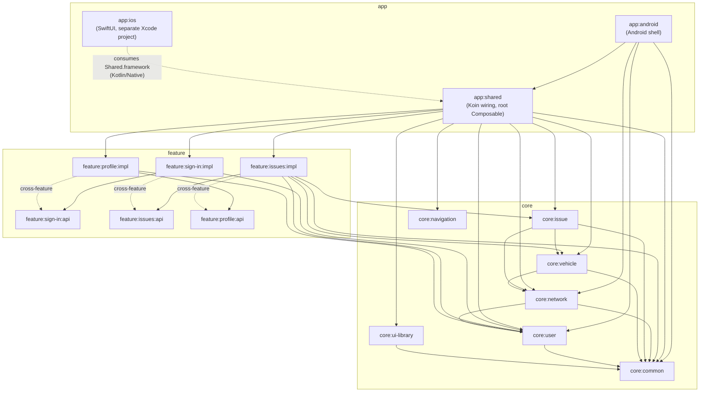

# TruckTrack — Client

[](https://github.com/piskula/TruckerTracker/actions/workflows/build-app.yml)
[](https://github.com/piskula/TruckerTracker/actions/workflows/release-app.yml)

Kotlin Multiplatform client for TruckTrack, targeting Android and iOS from one shared codebase. This is `app/` — its own Gradle build, part of the `TruckTrack` composite build. See the repo root `README.md` for how this fits alongside `server/` and `shared/`.

## Contents

- [Features](#features)
- [Tech stack](#tech-stack)
- [Getting started](#getting-started)
- [Continuous integration](#continuous-integration)
- [Project structure](#project-structure)
- [Testing](#testing)
- [Releasing](#releasing)
- [Docs](#docs)

## Features

- **Sign in** — OAuth/OIDC authentication via [kotlin-multiplatform-oidc](https://github.com/kalinjul/kotlin-multiplatform-oidc).
- **Issues** — drivers and mechanics report, view, and track vehicle issues by status and priority.
- **Profile** — user account details.
- **Vehicles** — vehicle records backing issue tracking (domain layer today; no dedicated screen
  yet).

## Tech stack

| Concern | Choice |
|---------|--------|
| UI | Compose Multiplatform (`org.jetbrains.compose`) |
| Navigation | Navigation 3 (`androidx.navigation3` + `org.jetbrains.androidx.navigation3:navigation3-ui`) |
| ViewModel | AndroidX ViewModel |
| DI | Koin |
| HTTP | Ktor Client |
| Logging | Kermit |
| Crash reporting | Firebase Crashlytics via [`dev.gitlive:firebase-crashlytics`](https://github.com/GitLiveApp/firebase-kotlin-sdk) |
| Serialization | Kotlinx Serialization |
| Auth / OIDC | [kotlin-multiplatform-oidc](https://github.com/kalinjul/kotlin-multiplatform-oidc) |
| Contract DTOs | `com.momosi.trucktrack:shared` — see `../shared/README.md` |

## Getting started

### Prerequisites

| Tool | Needed for | Check | Auth |
|---|---|---|---|
| JDK 25 | Gradle toolchain (`jvmToolchain(25)`, all modules) | `java -version` | — |
| Android SDK (cmdline-tools, platform 37, build-tools) | `./gradlew :app:android:assembleStagingDebug`, Android Studio | Android SDK path env var set (`ANDROID_HOME`) | — |
| Xcode 15+ + command line tools (**macOS only**) | Building `app:ios` | `xcode-select -p` | — |
| CocoaPods (**macOS only**) | Linking Firebase into `app:ios` (`ios/Podfile`) | `pod --version` | — |
| [`gh`](https://cli.github.com/) (GitHub CLI) | Agents inspecting CI runs/PRs/releases (`analyze-ci-failure`, `release-app` skills) | `gh auth status` | `gh auth login` |
| Node.js 20+ (current LTS) | Runs the Firebase MCP server via `npx` | `node --version` | — |
| [`firebase-tools`](https://firebase.google.com/docs/cli) | Firebase App Distribution setup, Crashlytics analysis, and the underlying tool the Firebase MCP server wraps | `firebase --version` | `firebase login` |

Run the **`setup-local-tools`** skill (`.claude/skills/setup-local-tools/SKILL.md`) to check which
of these are present/authenticated on your machine and get exact install commands for anything
missing.

### Build & run

Both platforms need a local Firebase config file first — neither is committed (see
`.claude/skills/setup-local-tools/SKILL.md`, "Firebase config files for local builds", for how to
get them): `app/android/google-services.json` and `ios/iosApp/GoogleService-Info.plist`.

Commands below assume you're inside `app/` (this build's own root). From the repo root, prefix
every task with `:app:`, e.g. `:app:app:android:assembleStagingDebug`.

**Android** — `./gradlew :app:android:assembleStagingDebug`, or open `app/` in Android Studio and
run the `app:android` configuration.

**iOS** — run `pod install` in `app/ios` (generates `iosApp.xcworkspace`), then open
`app/ios/iosApp.xcworkspace` (not the `.xcodeproj`) in Xcode (15+) and run.

### Build variants

| | Staging | Prod |
|---|---|---|
| Android app ID | `com.momosi.trucktrack.staging` | `com.momosi.trucktrack` |
| iOS bundle ID | `com.momosi.trucktrack.staging` | `com.momosi.trucktrack` |
| App name | Truck Track Staging | Truck Track |
| Select it | Android flavor `staging` (default) · iOS `APP_ENVIRONMENT=staging` (default) | Android flavor `prod` · iOS `APP_ENVIRONMENT=prod` |
| Backend API | [tt.momosi.org](https://tt.momosi.org/) | [transroute.org](https://transroute.org/) |
| Keycloak realm | [sso.momosi.org/realms/trucktrack](https://sso.momosi.org/realms/trucktrack/) · [admin](https://sso.momosi.org/admin/trucktrack/console/) | [sso.transroute.org/realms/transroute](https://sso.transroute.org/realms/transroute/) · [admin](https://sso.transroute.org/admin/transroute/console/) |
| OAuth redirect | `com.momosi.trucktrack.staging://auth/callback` | `com.momosi.trucktrack://auth/callback` |
| Distribution | [Firebase App Distribution](https://console.firebase.google.com/project/trucktrack-cf134/appdistribution) | Firebase App Distribution · Play Store (TBD) · App Store (TBD) |
| CI secrets | `FIREBASE_STAGING_ANDROID_APP_ID`, `FIREBASE_STAGING_IOS_APP_ID`, `IOS_STAGING_ADHOC_PROFILE_BASE64` | `FIREBASE_PROD_ANDROID_APP_ID`, `FIREBASE_PROD_IOS_APP_ID`, `IOS_PROD_ADHOC_PROFILE_BASE64` |

Values are set in `app/android/build.gradle.kts` (flavors) and `app/ios/Environment.xcconfig`.

## Continuous integration

Two GitHub Actions workflows run remotely — nothing to install locally to trigger them. `gh run
list` / `gh run view` (see the `analyze-ci-failure` skill) are the fastest way to inspect a run
without leaving the terminal.

### On every push to `main` (`build-app.yml`)

- The build and distribute jobs cover **both** environments (staging and prod) — see [Build variants](#build-variants).
- **`build-android`** — assembles the staging and prod debug APKs in one Gradle run.
- **`build-ios`** — archives a signed, device-installable staging and prod `.ipa` one after the other
  (sharing the Kotlin framework and CocoaPods build) if the iOS signing secrets are configured;
  otherwise falls back to unsigned iOS Simulator apps. The per-environment archive/export/dSYM
  steps live in the local `.github/actions/archive-ios-app` action.
- **`publish-release`** — replaces the assets on the repo's `latest` pre-release with whichever
  build(s) succeeded (publishes a partial release rather than blocking on both).
- **`distribute-android`** — pushes each debug APK to its own Firebase app (staging / prod), both to
  the `internal-testers` group in Firebase App Distribution.
- **`distribute-ios`** — pushes each signed `.ipa` to its own Firebase app (staging / prod), both to
  the `internal-testers` group in Firebase App Distribution. Skipped when the iOS signing secrets aren't configured.
- Skipped entirely for doc-only changes (`paths-ignore`: `**/*.md`, `.claude/**`, `docs/**`).

### On pushing a version tag (`release-app.yml`)

Every release covers **both** environments (staging and prod) from the same commit:

- **`prepare`** — validates the tag, derives `versionName`/`versionCode`, and writes the changelog
  since the previous tag.
- **`build-android`** and **`build-ios`** (in parallel) — signed staging + prod release APKs and AABs
  in one Gradle run; signed ad-hoc staging + prod `.ipa`s archived with the `Release` configuration
  (iOS is skipped with a warning when its signing secrets aren't configured).
- **`publish-release`** — creates the GitHub Release named after the tag with all artifacts at once
  and the changelog as notes. Fails if any Android artifact is missing; publishes without iOS (with a
  warning) if the `.ipa`s are missing.
- **`distribute-android`** / **`distribute-ios`** — push each APK / `.ipa` to its own Firebase app
  (staging / prod), both to the `release` group in Firebase App Distribution.
- **`upload-testflight`** — uploads the App Store signed prod `.ipa` to TestFlight.
- See [Releasing](#releasing) for the tag format and required secrets.

## Project structure

Multi-module KMP build — `app:*` (platform shells + shared app wiring), `core:*` (domain logic,
infra), `feature:*/api` + `feature:*/impl` (product features). See **`AGENTS.md`** for the full
module map, dependency rules, and coding conventions — that's the canonical reference for
contributing here (including for AI coding agents).

<details>
<summary>Module dependency graph</summary>



Solid arrows are `implementation`/`api` project dependencies (`settings.gradle.kts` +
`build.gradle.kts` across all modules); the dotted `cross-feature` arrows are `*/impl → other
feature's */api` edges, each carrying nothing but the destination feature's `NavKey` so an entry
provider can register it as a navigation target. That is the sanctioned use of an `api` module —
depending on another feature's `impl` is not. `core` modules form a DAG rooted at
`core:common` (everything depends on it, directly or transitively; nothing depends back), and
`core:navigation` has no internal dependencies at all.

Network DTOs (`IssueDto`, `VehicleDto`, `PageDto`, etc.) come from the separate `shared` build
(`../shared/`), not from any `core` module — see `../shared/README.md`.

</details>

## Testing

No automated tests exist yet. When adding them, follow the conventions in `AGENTS.md`:

- **MockK** for mocking, **Turbine** for `Flow` testing, **kotlinx-coroutines-test** (`runTest`)
  for coroutines.
- Shared tests go in `src/commonTest/kotlin/`, Android-specific tests in
  `src/androidTest/kotlin/`, mirroring the main source package.

## Releasing

A signed release (`.github/workflows/release-app.yml`, at the repo root) is cut by pushing a
version tag — there's no separate version bump commit, the tag *is* the version:

```bash
git tag v1.2.3
git push origin v1.2.3
```

- Tag must match `vMAJOR.MINOR.PATCH`, with `MINOR` and `PATCH` each under 100 (so
  `versionCode = MAJOR * 10000 + MINOR * 100 + PATCH` can't collide across versions).
- **Android** — produces signed `truck-track-<env>-<version>.apk` and `truck-track-<env>-<version>.aab`
  for `staging` and `prod`, built with `versionName`/`versionCode` embedded from the tag, published as a GitHub Release
  named after the tag. Requires four repo secrets: `ANDROID_KEYSTORE_BASE64`,
  `ANDROID_KEYSTORE_PASSWORD`, `ANDROID_KEY_ALIAS`, `ANDROID_KEY_PASSWORD`.
- **iOS** — produces signed ad-hoc `truck-track-<env>-<version>.ipa` for `staging` and `prod` (same `MARKETING_VERSION`/
  `CURRENT_PROJECT_VERSION` derived from the tag), attached to the same GitHub Release. Requires
  `IOS_TEAM_ID`, `IOS_DISTRIBUTION_CERTIFICATE_BASE64`, `IOS_DISTRIBUTION_CERTIFICATE_PASSWORD`,
  `IOS_STAGING_ADHOC_PROFILE_BASE64` and `IOS_PROD_ADHOC_PROFILE_BASE64` (all must be configured — see the `manage-ios-signing` skill for adding
  testers or renewing the certificate). If any go missing or expire, this step falls back to
  skipping with a warning rather than failing the release.
- **TestFlight** — the prod archive is additionally exported with the App Store profile and uploaded
  to App Store Connect by the `upload-testflight` job. Requires `IOS_PROD_APPSTORE_PROFILE_BASE64`,
  `APP_STORE_CONNECT_API_KEY_BASE64`, `APP_STORE_CONNECT_API_KEY_ID` and `APP_STORE_CONNECT_ISSUER_ID`;
  skipped with a warning when any are missing. Builds land in TestFlight for internal testers;
  submitting for App Store review is done manually in App Store Connect.
- Firebase distribution uses `FIREBASE_{STAGING,PROD}_{ANDROID,IOS}_APP_ID`, all to the `release`
  group. Play Store uploads aren't automated yet.

## Docs

- **`AGENTS.md`** (this directory) — module structure, dependency rules, architecture (MVVM), coding conventions. `../AGENTS.md` (repo root) covers the monorepo layout and repo-wide policy instead.
- **`../docs/TODO.md`** — product feature backlog.
- **`.claude/skills/`** — reusable agent workflows, including `setup-local-tools` for onboarding a
  new machine (see [Getting started](#getting-started)).
